The cognitiveVR SDK for Unity
=========
Welcome!  This SDK allows you to integrate your Unity games with cognitiveVR, which provides analytics and insights about your Unity project.  In addition, cognitiveVR empowers you with the ability to take actions that will improve users' engagement with your experience.

Getting Started
=========

Last Updated: April 22, 2016

_Note that the code examples below assume_ ```using CognitiveVR;``` _for brevity, but developers may prepend references with_ ```CognitiveVR.``` _as a matter of preference or for disambiguity._

## Initialization
[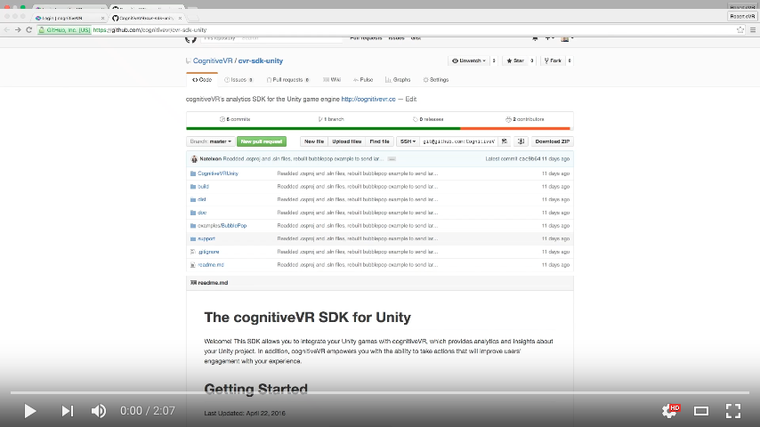](https://www.youtube.com/watch?v=1tKwxaoTalU "Unity Plugin Installation Tutorial")

CognitiveVR initialization should be completed as early as possible in the flow of an application. This allows
telemetry reporting and the usage of CognitiveVR tuned variables throughout the application. Note that the
initialization call triggers a callback upon completion, after which point you can reliably use any of
the calls in the CognitiveVR SDK.

Here's an example, passing ```[InitParams](@ref CognitiveVR::InitParams)``` to ```[Core.init](@ref CognitiveVR::Core::init)```:

```C#
using CognitiveVR;
```

(...)

```C#

CognitiveVR.InitParams initParams = CognitiveVR.InitParams.create(
    // customer id is the only required field
    "my-customer-id" // contact CognitiveVR if you do not have a customer id yet

    // if you have additional information about your user or device to report at startup, you can
    //,userInfo: myUserInfo               // more below about user...
    //,deviceInfo: myDeviceInfo            // ...and device entities
);
Core.init(initParams, delegate(Error initError) {
    // let application know that CognitiveVR is ready
});
```

Most of our customers add the CognitiveVR initialization in ```void Start() { ... }```.

### Notifications
To use CognitiveVR Push Notifications, set up a notification listener (a method with the signature ```void(String message, bool wasLaunchedBy)```) on the InitParams object.  This listener will be called when your app receives a push notification:

```C#
initParams.OnNotification = delegate(string message, bool wasLaunchedBy)
    {
      Debug.Log("Received notification!  Was I launched by it? " + (wasLaunchedBy ? "Yes" : "No") + ". Message: " + message);
    };
```

For Android, make sure you have the following permissions and intents set up in the AndroidManifest.xml:

```XML
<?xml version="1.0" encoding="utf-8"?>
<manifest xmlns:android="http://schemas.android.com/apk/res/android" package="com.cvr.example" android:theme="@android:style/Theme.NoTitleBar" android:versionName="1.2" android:versionCode="3" android:installLocation="preferExternal">
  <supports-screens android:smallScreens="true" android:normalScreens="true" android:largeScreens="true" android:xlargeScreens="true" android:anyDensity="true" />
  <application android:icon="@drawable/app_icon" android:label="@string/app_name" android:debuggable="false">
    <activity android:name="com.unity3d.player.UnityPlayerNativeActivity" android:label="@string/app_name" android:screenOrientation="portrait" android:launchMode="singleTask" android:configChanges="mcc|mnc|locale|touchscreen|keyboard|keyboardHidden|navigation|orientation|screenLayout|uiMode|screenSize|smallestScreenSize|fontScale">
      <intent-filter>
        <action android:name="android.intent.action.MAIN" />
        <category android:name="android.intent.category.LAUNCHER" />
      </intent-filter>
      <meta-data android:name="unityplayer.UnityActivity" android:value="true" />
      <meta-data android:name="unityplayer.ForwardNativeEventsToDalvik" android:value="false" />
    </activity>
    <meta-data android:name="com.google.android.gms.version" android:value="@integer/google_play_services_version" />
    <receiver
        android:name="com.cvr.GcmBroadcastReceiver"
        android:permission="com.google.android.c2dm.permission.SEND">
        <intent-filter>
            <action android:name="com.google.android.c2dm.intent.RECEIVE"/>
            <category android:name="com.cvr.bubblepop"/>
        </intent-filter>
    </receiver>
    <receiver android:name="com.cvr.GcmUpdateReceiver">
        <intent-filter>
            <action android:name="android.intent.action.PACKAGE_REPLACED"/>
            <data android:path="com.cvr.bubblepop" android:scheme="package"/>
        </intent-filter>
        <intent-filter>
            <action android:name="android.intent.action.BOOT_COMPLETED"/>
        </intent-filter>
    </receiver>
    <service android:name="com.cvr.GcmIntentService"/>
  </application>
  <uses-permission android:name="android.permission.INTERNET" />

  <!-- ADM uses WAKE_LOCK to keep the processor from sleeping when a message is received. -->
  <uses-permission android:name="android.permission.WAKE_LOCK"/>

  <!-- This permission allows your app access to receive push notifications from ADM/GCM. -->
  <uses-permission android:name="com.amazon.device.messaging.permission.RECEIVE"/>
  <uses-permission android:name="com.google.android.c2dm.permission.RECEIVE"/>

  <!-- This permission ensures that no other application can intercept your ADM/GCM messages. -->
  <permission android:name="com.cvr.bubblepop.permission.RECEIVE_ADM_MESSAGE" android:protectionLevel="signature"/>
  <uses-permission android:name="com.cvr.bubblepop.permission.RECEIVE_ADM_MESSAGE"/>

  <permission android:name="com.cvr.bubblepop.permission.C2D_MESSAGE" android:protectionLevel="signature"/>
  <uses-permission android:name="com.cvr.bubblepop.permission.C2D_MESSAGE"/>

  <!-- This permission allows us to detect when the user performs a system update.
       Note that this is not required for push notifications to work, but it does guarantee that notifications will still
       be sent to the device after a system update, even if the user doesn't launch the app.
  -->
  <uses-permission android:name="android.permission.RECEIVE_BOOT_COMPLETED"/>
</manifest>
```

### Devices
CognitiveVR will automatically track some hardware information about your device, but if you have additional (perhaps application-specific) properties to report, you can do so at initialization time.  To do this, provide ```deviceInfo``` to the ```init``` call, using ```[createDeviceInfo](@ref CognitiveVR::EntityInfo::createDeviceInfo)```:

```C#
EntityInfo myDeviceInfo = EntityInfo.createDeviceInfo().setProperty("aProperty", 1).setProperty("aboutMyDevice", "how_interesting");
```

or:

```C#
Dictionary<string, object> myDeviceProperties = new Dictionary<string, object> { { "aProperty", 1 }, { "aboutMyDevice", "how_interesting" } };
EntityInfo myDeviceInfo = EntityInfo.createDeviceInfo(properties: myDeviceProperties);
```

To report any changes to the state of the device at any later point, see ```[updateDeviceState](@ref CognitiveVR::Instrumentation::updateDeviceState)```.

### Users
Many applications track individual users with some form of user ID. For such applications, if you know the user ID at startup, it is recommended to
pass a ```userInfo``` to the ```init``` call using ```[createUserInfo](@ref CognitiveVR::EntityInfo::createUserInfo)```:

```C#
EntityInfo myUserInfo = EntityInfo.createUserInfo("theUserId");
```

Note that you may also use ```[setProperty](@ref CognitiveVR::EntityInfo::setProperty)``` or ```[setProperties](@ref CognitiveVR::EntityInfo::setProperties)```, as in the device case above, if you have additional state to track for the user:

```C#
EntityInfo myUserInfo2 = EntityInfo.createUserInfo("theUserId").setProperty("level", 10);
```

If the user is *not* known at startup, they can be registered at a later point, by creating an ```[EntityInfo](@ref CognitiveVR::EntityInfo)``` as we've just done, and providing it to ```[registerUser](@ref CognitiveVR::Core::registerUser)```:

```C#
Core.registerUser(myUserInfo, delegate(Error registerUserError) {
    /* application may now safely log telemetry and use tuned variables for the user */
});
```

For applications which allow multiple concurrent users, see ```[setActiveUser](@ref CognitiveVR::Core::setActiveUser)```.<br>
For applications which need to support users 'logging out', see ```[clearActiveUser](@ref CognitiveVR::Core::clearActiveUser).```<br>
To report any changes to the state of the user at any later point, see ```[updateUserState](@ref CognitiveVR::Instrumentation::updateUserState)```.

## Telemetry
### Transactions
Transactions are the primary unit of telemetry in CognitiveVR. Reporting events with a ```[Transaction](@ref CognitiveVR::Transaction)``` is simple, but powerful. Consider:

```C#
Instrumentation.Transaction("UserAction").begin();
// time passes
Instrumentation.Transaction("UserAction").setProperty("something interesting", "about the transaction").end();
```

Note that properties of the transaction may be set for ```[begin](@ref CognitiveVR::Transaction::begin)``` or ```[end](@ref CognitiveVR::Transaction::end)``` or at any point between with
```[update](@ref CognitiveVR::Transaction::update)```, but as a best practice they should be reported as early as their value is known or known to have changed.

To handle the somewhat common case where a transaction occurs instantaneously, use the ```[beginAndEnd](@ref CognitiveVR::Transaction::beginAndEnd)``` method.

Also note that the setting of transaction properties is only persisted after a call to ```begin```, ```update```, ```end```, or ```beginAndEnd```.

### Collections
Collections in CognitiveVR are an abstraction for anything the user of the application might accumulate, or have a varying quantity of. Common examples of this might be
virtual currency, number of contacts, or achievements. ```[updateCollection](@ref CognitiveVR::Instrumentation::updateCollection)``` can be used at any point where the quantity
of a collection is thought to have changed:

```C#
Instrumentation.updateCollection("friends", 27, -2, false);
```

It is recommended to instrument all of the important collections in the application, as they will add surprising power to your data analysis through contextualization.

### Entity state
As previously mentioned, user and device (considered CognitiveVR entities) may have their state recorded during initialization, or through usage of
```[updateUserState](@ref CognitiveVR::Instrumentation::updateUserState)``` and ```[updateDeviceState](@ref CognitiveVR::Instrumentation::updateDeviceState)```. Reporting
changes in entity state is another great way to unlock the power of contextualization.

## Tuning
The CognitiveVR Tuning system provides a means for dynamically altering the behavior of the application, conducting an A/Z test, and creating customized behavior for segments
of your user base (targeting). The instrumentation is extremely simple, and the hardest part might be decided what you want to be able to tune. Upon initialization, CognitiveVR will retrieve
any dynamic tuning for the device or user. At any point thereafter, the application may request a value using ```[getVar](\ref CognitiveVR::Tuning)```:

```C#
// before CognitiveVR
string welcomeString = "Hi there!";
double welcomeDuration =3.0;

// with CognitiveVR tuning variables
string welcomeString = Tuning.getVar("welcomeString", "Hi there!");
double welcomeDuration = Tuning.getVar("welcomeTime", 3.0);
```

Note the presence of the second parameter, which specifies a default value. It is important to provide a 'safe' default value to provide reliable behavior in the event that a
dynamic value is not available. This also allows for the application to be safely instrumented in advance of any dynamic tuning, targeting, or A/Z test.

In addition to instrumenting key points in your code with ```[getVar](@ref CognitiveVR::Tuning)```, applications which may remain running for long periods of time are encouraged to utilize ```[refresh](@ref CognitiveVR::Tuning::refresh)``` in order to make sure that the application has access to the latest tuned values at any point in time. A typical integration point for ```refresh``` on a mobile application might be whenever the application is brought to the foreground, and the code for handling it is quite simple:

```C#
Tuning.refresh(delegate(Error refreshError) {
    // at this point, tuning for the device and all registered users should be refreshed
});
```

It is not necessary to block for the completion of this call, as is typically recommended for ```[init](@ref CognitiveVR::Core::init)```
and ```[registerUser](@ref CognitiveVR::Core::registerUser)```, since the application should already have access to viable tuned variables prior to the call to refresh.
However, the callback is provided, leaving it to the discretion of the integrator.

## Mobile Applications
For mobile applications, it is likely that the app may be foregrounded and backgrounded many times during it's lifetime. In addition, it is best practice to ensure that applications
can function properly under poor network conditions, or even when the device has no network connection. In order to support these characteristics, the CognitiveVR SDK is designed to
protect your telemetry in these situations. However, there's a small bit that needs to be done by the implementor.

When the application is backgrounded, call ```[pause](@ref CognitiveVR::Core::pause)```:
```C#
Core.pause();
```

And then when it is foregrounded, call ```[resume](@ref CognitiveVR::Core::resume)```:
```C#
Core.resume();
```

If necessary, you can still report telemetry while CognitiveVR is in a paused state, but the telemetry calls may execute more slowly, due to data being read and written from device local storage.

Adding CognitiveVR to Your Own App
=========

Last Updated: April 22, 2016

In the BubblePop sample, both the Unity package and project versions were preconfigured to use the CognitiveVR SDK Unity package.

When adding CognitiveVR to your own app, you will need to import this package yourself.  To do so, follow these steps:

1. Open your Unity project.
2. In Unity's Project Browser, right-click (sometimes referred to as a Control-click or Secondary click) on the root Assets folder, and then choose **Import Package | Custom Package...**:
    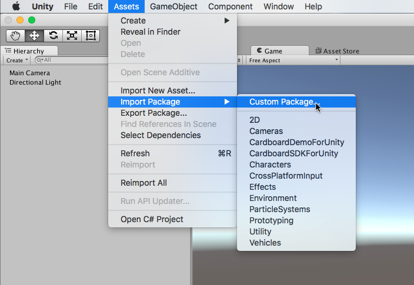
3. In the window that appears, find the directory where you extracted the SDK and navigate to its `packages` subdirectory. Highlight the `CognitiveVR.unitypackage` file and then click **Open**.
    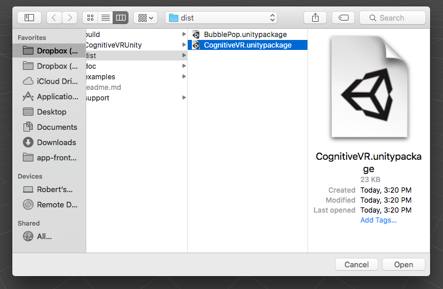
4. A dialog will appear listing the contents of the package, all of them checked by default.  Leave everything checked and click **Import**
*(Note: After importing, you may see an error message in the status bar or Console window that says `typeTree.m_Children.front().m_Type != SerializeTraits<SInt32>::GetTypeString(NULL)`. This is a known issue.  The error message goes away the first time you build or run the BubblePop sample, and does not block it from functioning correctly).*
    
5. At this point, you should be able to start adding code to your app that uses the CognitiveVR APIs to send telemetry data.


Using the BubblePop Sample
=========

Last Updated: April 22, 2016

## Introduction

The SDK includes a very simple Unity game that exercises some of the features of CognitiveVR.  This serves as a good starting point for many new users.  By stepping through the sample code, you can see how the CognitiveVR APIs are called.  Further, you can use CognitiveVR's SDK Debugger tool to verify that telemetry sent by these APIs were received by CognitiveVR.

BubblePop is an extremely simple game that sends data to CognitiveVR.  In this game:

* You have a balance of virtual currency, referred to as "gold".
* To play a game, you need to spend some of your gold.
* In the game, you click on bubbles to pop them.  One of these bubbles is a "winning" bubble.  The goal is to find that bubble before it is the only one left.
* If you win and find the winning bubble before it is the only one left, you are awarded some gold.
* You can also add more gold to your account by making an in-app purchase (don't worry -- in this sample game you don't actually have to spend money to make an in-app purchase!).

Admittedly, this game is not technically impressive; nor is it even all that much fun!  It simply exists to illustrate the steps involved in implementing CognitiveVR in an app.

The following steps walk you through the process of running the BubblePop sample.  These steps are based on Unity 4 running on Mac OS X.  The steps should be similar for other platforms and versions of Unity.

## Working with the Sample Application

The SDK provides the BubblePop sample as both a Unity package and as a Unity project.

The advantage of a package is that it is less sensitive to Unity version differences than a project is.  So if you are using an older version of Unity and have difficulty opening the BubblePop project, try importing the BubblePop Unity package instead.

The sample project was created using Unity 4.3.3f1, and may not be usable from older versions of Unity.  In this case, try using the package version of the sample instead.

### Setting Up the Sample Project

The two sections that follow walk you through the two different ways of setting up the sample application. The first is based on the Unity package.  The second is based on a Unity project.  You only need to follow the steps from one of these sections, based on your Unity version and preference.

With either option, the very first thing you'll need to do is to start Unity.  On Mac OS X, Unity is normally installed to the `/Applications/Unity` folder:

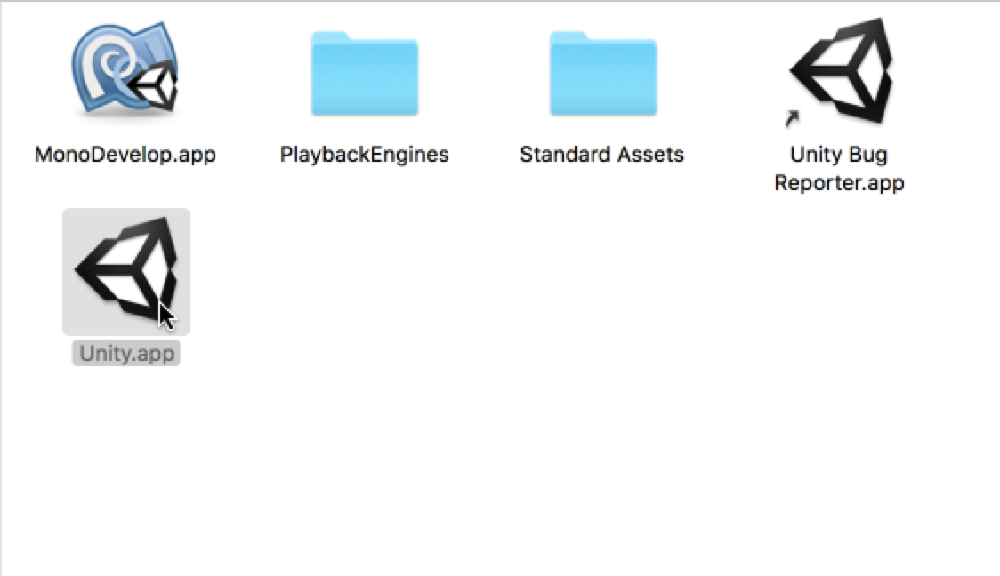

#### Option 1: Set Up the Sample Using `BubblePop.unitypackage`

1. After starting Unity, if the **Project Wizard** window does not open automatically when starting Unity, then open it by selecting Unity's **File** menu, then selecting **New Project...**, as shown below.
    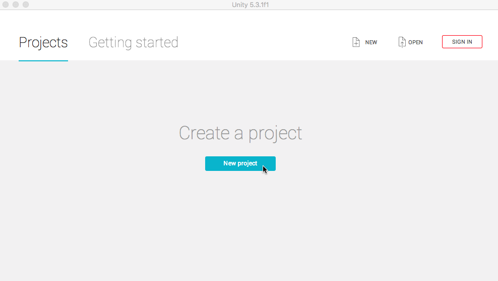
2. In the **Project Wizard** window, click **Create new Project**.  Then set the **Project Directory** to the location where you want to store the project, and then click **Create Project**:
    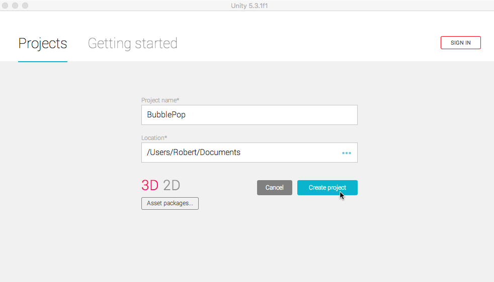
3. In Unity's Project Browser, right-click (sometimes referred to as a Control-click or Secondary click) on the root Assets folder, and then choose **Import Package | Custom Package...**:
    
4. In the window that appears, find the directory where you extracted the SDK and navigate to its `packages` subdirectory.  Highlight the file `BubblePop.unitypackage` and then click **Open**.
    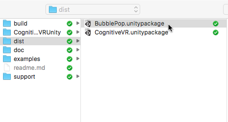
5. A dialog will appear listing the contents of the package, all of them checked by default.  Leave everything checked and click **Import**.
*(Note: After importing, you may see an error message in the status bar or Console window that says `typeTree.m_Children.front ().m_Type != SerializeTraits<SInt32>::GetTypeString (NULL)`.
This is a known issue.  The error message goes away the first time you build or run the BubblePop sample, and does not block it from functioning correctly).*
    
6. At this point, the sample project should be set up correctly.  Skip to the section [Running the Sample](#running) for the next steps you need to perform in order to run it.

#### Option 2: Set Up the Sample Using the BubblePop Project

1. After starting Unity, if the **Project Wizard** window does not open automatically when starting Unity, then open it by selecting the **File | Open Project...** menu item as shown below:
    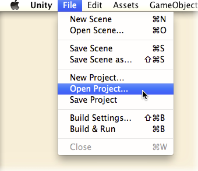
2. In the **Project Wizard** window, click **Open Other...**
    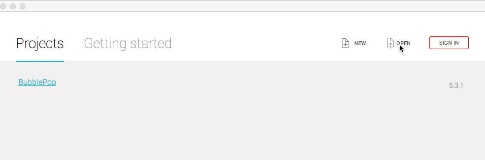
3. Find the directory where you extracted the SDK and navigate to its `examples` subdirectory.  Inside of `examples`, highlight the `BubblePop` subdirectory and then click **Open**.
    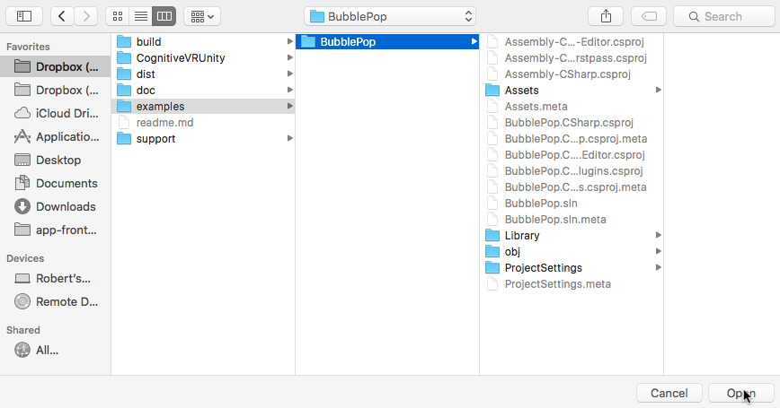
4. At this point, the sample project should be set up correctly.  Continue on to the section [Running the Sample](#running) for the next steps you need to perform in order to run it.

### Running the Sample

Once you have set up the BubblePop sample project set up, you need to follow a few more steps to run it.

#### Optional: Setting Your CognitiveVR product ID

To see your events in CognitiveVR, the game needs to be initialized with your unique product ID.

Note that you may skip this step and continue to run the sample. However, if you skip this step, the data for BubblePop will not be visible to you in CognitiveVR's SDK debugger and dashboards.

If you *do* choose to set your product ID to send BubblePop data to CognitiveVR, you will only want to send it to your `test` environment.  And if you wish to remove the BubblePop data from CognitiveVR at a later date, you will need to send a request to the [CognitiveVR Support Team](mailto:support@cognitivevr.co) to do this for you.  A request to clear the data in your CognitiveVR `test` environment will result in *all* data being removed, whether it came from the BubblePop sample or your own app.

1. To use your specific product ID, we'll need to change the code in BubblePop. To open the BubblePop code, right-click anywhere in the **Assets** pane and then click **Open C# Project**:
    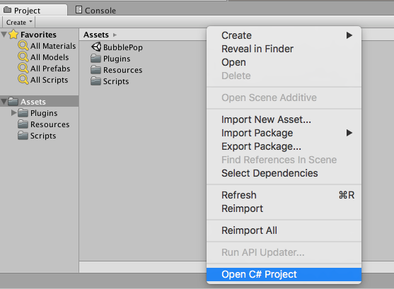
2. The MonoDevelop-Unity IDE will open.  Edit the file `BubblePop.cs`, and look for the spot where the initialization parameters for CognitiveVR are created.  Change the default product ID  from `cvr-unity-test` to your own product ID.  Be sure to specify the product ID for your test environment; it should end with the characters "```-test```" *(Note: If you do not have or do not know your CognitiveVR product ID, contact [support@cognitivevr.co](mailto:support@cognitivevr.co) to get one)*.
    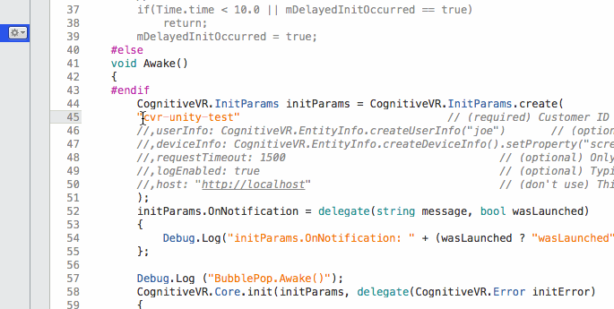
3. Close the MonoDevelop-Unity IDE and return to Unity.

#### Set the Scene and Run BubblePop

At this point, you should have your project set up.  We're almost ready to run!  Just follow these few additional steps:

1. In the Project Browser, make sure the the root Assets folder is selected.  Then, in **Assets** pane, double-click **BubblePop** to
make it the active scene.
*(Note: You may get a prompt asking if you to save the changes to the current untitled scene.  If you do, you can
simply click **Don't Save** to discard it)*.
    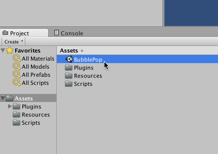
2. Press the **Play** button in the Unity toolbar to start BubblePop.  The game should start:
    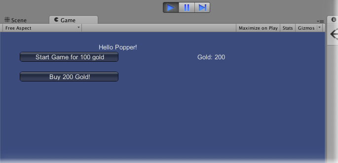
3. You can click around in the BubblePop game to play. If necessary, you can refer back to the [introduction](#introduction) for a description of this simple game.
4. Note that in the current release of this SDK, only iOS and Android are supported.  To see your events arriving at CognitiveVR, you will need to generate and run a build for one of those devices.  The next section walks through this process.

## Viewing Your Data in CognitiveVR

If you chose to [set up a valid product ID for BubblePop](#productid), then you can use CognitiveVR's SDK Debugger to verify that CognitiveVR is receiving the data sent by BubblePop.  To do this, follow these steps:

### Generate and Run an iOS or Android Build

This SDK release supports iOS and Android.  If you target any other platform, the CognitiveVR API calls simply act as stubs and no data will actually be sent to CognitiveVR.  So to see data arriving at CognitiveVR, we need to build for one of these platforms.  These instructions walk through the necessary steps for iOS.

1. In Unity, choose the **File | Build Settings...** menu item:
    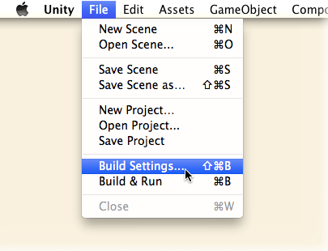
2. In the **Build Settings** window, select **iOS** as the platform, and then click **Build and Run**.
    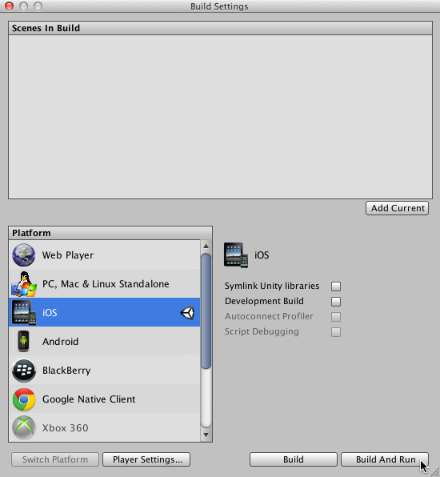
3. Unity will generate an Xcode project for iOS.  A window opens where you can specify the directory where the Xcode project will be created.  Specify your desired location and click **Save**:
    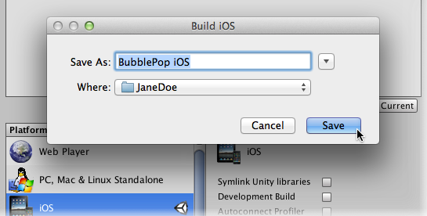
4. After Unity finishes creating the Xcode project, Xcode will open.  Click the Play button to build and run the project.
    
5. BubblePop will build and begin running on your iOS device or simulator, depending on the selected scheme in Xcode.  You can click around in the BubblePop game to play. If necessary, refer back to the [introduction](#introduction) for a description of this simple game:
    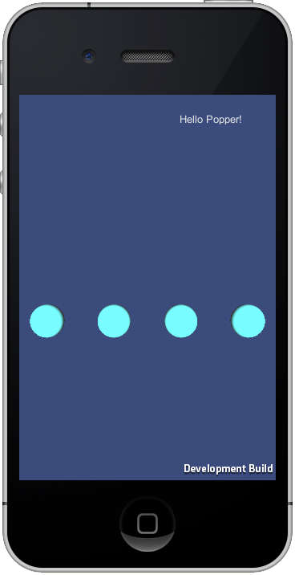

### Using the SDK Debugger Page to View your Data

As BubblePop runs on the device, it will send data to CognitiveVR about what is happening in the game. You can use CognitiveVR's SDK Debugger page to verify that this data is arriving at CognitiveVR.

1. Open a web browser, navigate to [https://dashboard.cognitivevr.co](https://dashboard.cognitivevr.io), and log into CognitiveVR.
2. Choose the product [whose product ID you specified](#productid) when you set up the sample:
    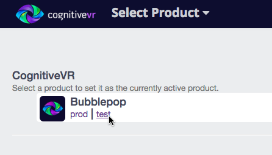
3. Choose **Tools** from the nav bar on the top right:
    
4.  Once in the Tools section, choose the **Debugger** tool from the nav bar on the left.
5.  As you continue to play the BubblePop game that you started on iOS during the steps above, the SDK Debugger page will periodically refresh and show data that the game is sending to CognitiveVR.  You can use this to verify that your app is able to talk to CognitiveVR, and that your instrumentation is correct.
    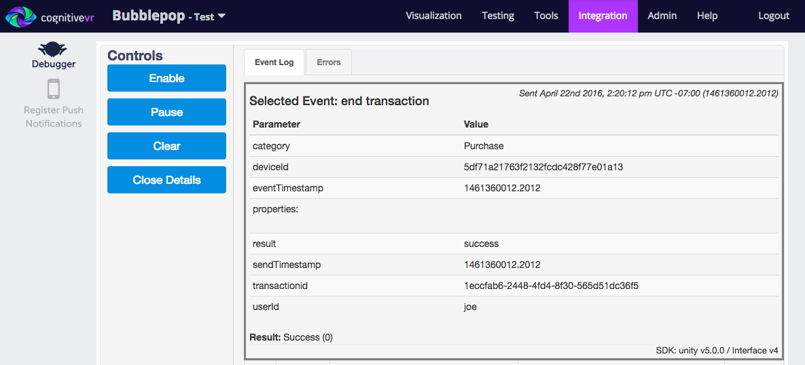
    Some tips on how to use this page:
    * The page shows the 25 most recently received events.
    * By clicking on a given event/row, you will see more details.  These details make it easier to match up the data that you see in the debugger with the spot in your code where you called CognitiveVR to send the data. Click the **Close Details** button to dismiss these details.
    * If there are any errors in the data that gets sent, they will be highlighted in red.
    * This page shows events received from *all* clients running your app.  It's best to use this page when few clients are running, so that the event stream is more easily interpretable.
    * The controls on the left include a **Play/Pause** toggle and a **Clear** button:
      * If you toggle the page to **Pause** mode, it will not refresh with new events until you toggle it back to **Play**.  At that point, all events received since the page was paused will be retrieved.
      * **Clear** permanently removes all events currently shown on the page.
    * This page only works for test environments (i.e., for CognitiveVR product IDs ending in `-test`).
6. Data that is received by CognitiveVR will ultimately be included into all the charts available from the **Visualization** section of CognitiveVR.  CognitiveVR processes your data periodically throughout the day.  In general, you should expect your dashboards to update with new data within a couple of hours of the time it was received.

### Compiling the Plugin

Unity plugins are somewhat finicky. If you are having compiler issues such as ```The type or namespace <example> does not exist``` try open your project in Unity again and compile from there.
