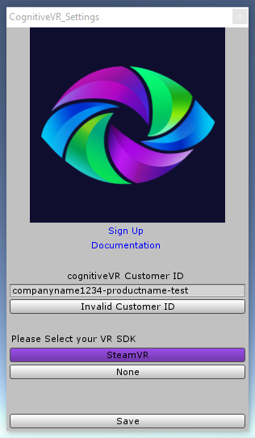
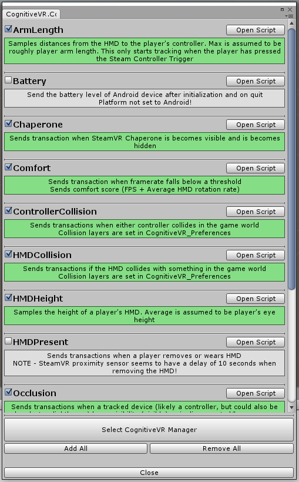

The cognitiveVR SDK for Unity
=========
Welcome!  This SDK allows you to integrate your Unity games with cognitiveVR, which provides analytics and insights about your Unity project.  In addition, cognitiveVR empowers you with the ability to take actions that will improve users' engagement with your experience.

**This plugin now requires Unity 5.4.1p1 or newer**

Last Updated: Nov 1, 2016


Quickstart
=========
## Sign up
If you have not already done so, please register at
[https://dashboard.cognitivevr.co](https://dashboard.cognitivevr.io).

## Download the SDK
You can clone this git repo to stay up to date with fixes and changes. You can also download the unity package directly from the Releases page : [Releases](https://github.com/CognitiveVR/cvr-sdk-unity/releases)

## Import SDK
Follow the standard unity package import process. You can import a custom package from the Assets>Import Package>Custom Package... menu option.


If you are having problems updating to the latest version of the cognitiveVR Unity SDK, it is recommended that you delete the existing cognitiveVR folders :
```
Assets/Plugins/CognitiveVR
Assets/Plugins/CognitiveVR.dll
```

## CognitiveVR Settings window


### CustomerID
This is required to send telemetry from your application. The format is : ```yourcompanyname1234-productname-test```. This is taken from the dashboard on your product page.


### Add CognitiveVR Manager
This button will create a prefab that will automatically initialize cognitiveVR analytics. This prefab will also hold and activate the components selected in the component window (see below)

### VR SDK
Select the SDK you are using for implementing VR into your Unity project. The cognitiveVR SDK should function correctly with any VR SDK you might be using, but additional functionality has been written for these supported SDKs. You can select multiple SDKs by shift-clicking the options.

## Done!
That's it! You are now tracking your user's basic data including GPU,CPU,OS and RAM. Unity 5.4 users will also receive the model of Head Mounted Display.

## Component Window
After saving these settings, you can open the component window to add more functionality to your project. See the documentation for details



cognitiveVR Documentation
=========
This is only a quick reference to set up the cognitiveVR SDK. The documentation explains the concepts behind the SDK and provides more code samples.

[Go to the Docs](http://docs.cognitivevr.io/unity/get-started/)