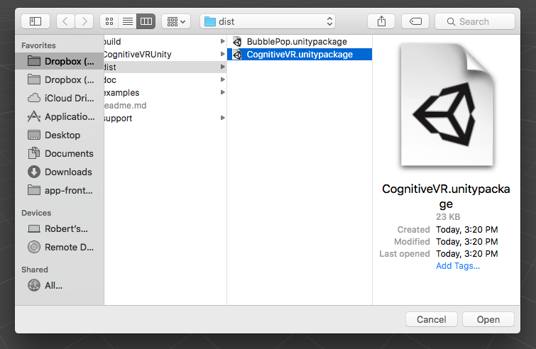
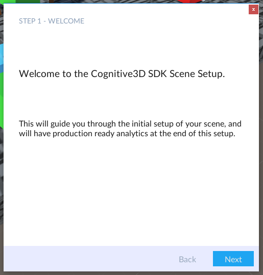

The Cognitive3D SDK for Unity
=========
Welcome!  This SDK allows you to integrate your Unity games with Cognitive3D, which provides analytics and insights about your Unity project.  In addition, Cognitive3D empowers you to take actions that will improve users' engagement with your experience.

**This plugin requires Unity 2019.4.40f1 or newer**

Quickstart
=========
## Download the SDK
You can clone this git repo to stay up to date with fixes and changes. You can also download the Unity package directly from the Releases page : [Releases](https://github.com/CognitiveVR/cvr-sdk-unity/releases)

## Import SDK
Follow the standard unity package import process. You can import a custom package from the **Assets->Import Package->Custom Package...** menu option.

## Cognitive3D Scene Setup window
Once everything has imported correctly click **cognitive3D->Scene Setup** from the menu and follow the Scene Setup Wizard

## Cognitive3D Documentation
The documentation explains how to authenticate with the SDK, track your users' experience and how to export your scene to view on Cognitive3D.com

[Go to the Docs](https://docs.cognitive3d.com/unity/minimal-setup-guide/)
