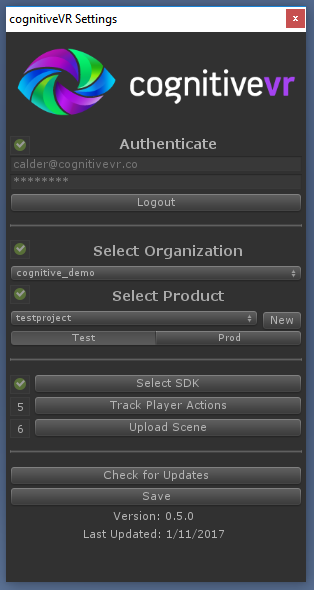

The Cognitive3D SDK for Unity
=========
Welcome!  This SDK allows you to integrate your Unity games with Cognitive3D, which provides analytics and insights about your Unity project.  In addition, Cognitive3D empowers you with the ability to take actions that will improve users' engagement with your experience.

**This plugin requires Unity 5.6.3p2 or newer**

Quickstart
=========
## Sign up
If you have not already done so, please register at
[https://dashboard.cognitivevr.co](https://dashboard.cognitivevr.io).

## Download the SDK
You can clone this git repo to stay up to date with fixes and changes. You can also download the Unity package directly from the Releases page : [Releases](https://github.com/CognitiveVR/cvr-sdk-unity/releases)

## Import SDK
Follow the standard unity package import process. You can import a custom package from the Assets>Import Package>Custom Package... menu option.

## Cognitive3D Settings window
If everything has imported correctly, this Settings window should appear automatically.

Cognitive3D Documentation
=========
The documentation explains how to login to the SDK, track your users' experience and how to export your scene to view on SceneExplorer.com

[Go to the Docs](http://docs.cognitivevr.io/unity/get-started/)
